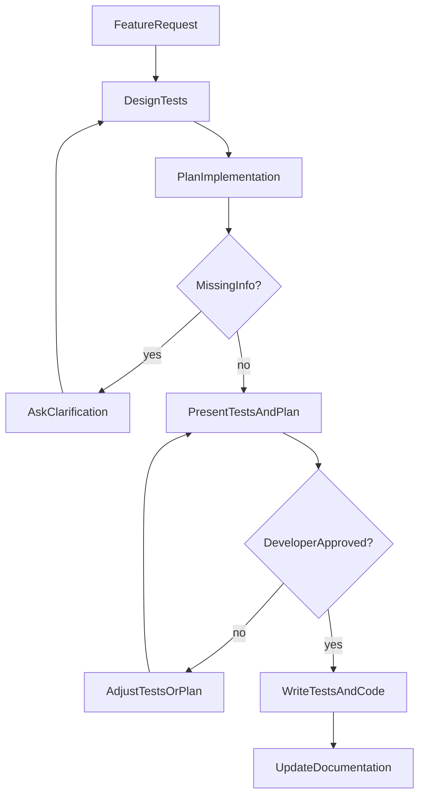

# Feature Development

Test-first, approval-gated workflow for implementing features in RO Flex UI.

## When to Use

Apply this skill when:

- Implementing new components, panels, or APIs
- Adding or changing requested functionality
- The user explicitly asks to follow the development workflow

## Core Workflow

0. Read [UI Element Development Guidelines](../../../Documentation~/ui-element-guidelines.md) and the relevant [integration spec](../../../Documentation~/specs/README.md) when one exists
1. Design tests for the requested feature that covers the public API and functionalities
2. Tests should be meaningful, and add robustness to the requested feature
3. Plan the implementation to fill the tests and requested functionalities
4. Create an implementation plan before writing any code
5. Ask for clarification for parts that are missing information
6. Adjust tests/implementation/clarification steps until fully approved by the Developer
7. Add/update documentation based on examples and other components

## Workflow Diagram



## Phase Details

### Steps 1–2: Design Tests

1. Read the target source under `RO Flex UI/Runtime/Scripts/`.
2. Enumerate the public API: properties, methods, events, and observable behaviors.
3. Propose a **test design document** — not test code yet.
4. Cover happy paths, edge cases, and failure modes.
5. Skip trivial assertions that do not add robustness.

For project test patterns, see [conventions.md](conventions.md).

### Steps 3–4: Plan Implementation

1. Produce an **implementation plan** listing files to create or change.
2. Map each proposed test to the code that will make it pass.
3. Note dependencies on other components, prefabs, or assemblies.
4. **Do not write production or test code** until the plan is approved.

### Step 5: Clarify

Ask the Developer when requirements are ambiguous:

- Missing API contracts or expected behavior
- Edit Mode vs Play Mode test choice
- Documentation scope or canonical doc path
- Edge cases with no clear specification

Use `AskQuestion` when structured choices help; otherwise ask conversationally.

### Step 6: Approval Loop

Present the **test design** and **implementation plan** together. Wait for explicit Developer approval before coding. Revise on feedback until fully approved.

### Step 7: Implement and Document

After approval, execute in order:

1. Write tests
2. Implement feature code to make tests pass
3. Run tests
4. Add or update documentation

## Approval Gate

Copy this checklist into the response before writing any code:

```
- [ ] Test design covers public API and key behaviors
- [ ] Implementation plan maps tests to code changes
- [ ] Open questions resolved or explicitly deferred
- [ ] Developer approved tests + plan
```

**Do not proceed past this gate without explicit Developer approval.**

## Deliverables by Phase

| Phase | Deliverable |
|-------|-------------|
| Test design | Named test cases, behaviors covered, Edit/Play Mode choice |
| Implementation plan | Files to change, API shape, test-to-code mapping |
| After approval | Test files, implementation, passing tests, updated docs |

## Additional Resources

- Project test and documentation conventions: [conventions.md](conventions.md)
