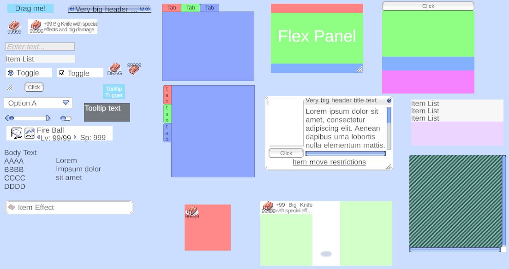

# RO Flexible UI

Ragnarok Online inspired collection of Unity components to build UI. It includes prefabs and scripts for things such as buttons, sliders, checkbox, toggles, panels, etc, which should simplify the process of building UI elements for games.

